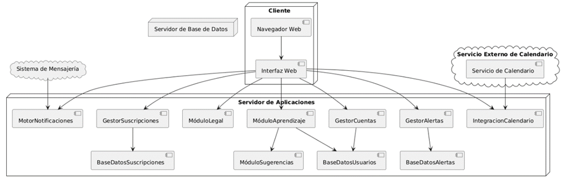
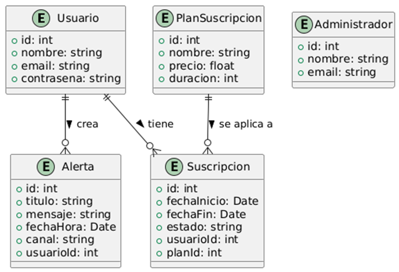

# Descripción
Este proyecto es una aplicación web de gestión de alertas desarrollada con Vue.js y Vuetify. Permite a los usuarios crear, editar, y eliminar alertas con diferentes medios de notificación. La aplicación presenta una tabla dinámica que se adapta al tamaño de la pantalla, permitiendo gestionar de manera eficiente un número grande de alertas.

# Diagrama de la Arquitectura
A continuación se muestra un diagrama de la arquitectura de la aplicación:

# Descripción del diagrama:

-**Frontend (Interfaz Web):** Construido con Vue.js, Vuetify y utiliza un diseño responsivo para adaptarse a diferentes dispositivos, permitiendo administrar las alertas, desde su creación, modificación, y eliminación de las mismas.

-**Backend (Servidor de Aplicaciones):** El backend mantendrá guardadacada una de las alertas y su información, y se encargará de enviarla en el momento correspondiente con la información correspondiente.

-**Bases de datos:** La base de datos mantendrá un control de los usuarios, tanto usuarios comunes como desarrolladores, así como su plan de suscripción, los cuales también serán almacenados en la base de datos. De igual forma, las alertas serán almacenadas en la base de datos con el fin de no perder la información de las alertas, y al momento de ser enviadas se borrará automáticamente de la base de datos.

-**Servicios de Notificación:** Integración con plataformas externas para enviar alertas a través de varios canales como WhatsApp, Telegram, etc.

-**Vinculación con calendario:** El sistema tendrá la posibilidad de conectar un calendario externo, como el de Google, a la cuenta del usuario, permitiendo crear una copia de cada uno de los eventos en el calendario de forma automática para crear una alarma de cada uno de los eventos y notificando al usuario de ello para que elija el medio por el cual desea que se le envíen dichas alertas.

-**Aprendizaje automático:** El sistema contará con un módulo de aprendizaje autónomo, el cual va a aprender de cada usuario para crear un perfil más personalizado y comenzar a hacerle sugerencias al mismo usuario a la hora de crear nuevas alertas o modificar las ya existentes.

# Descripción de las clases del sistema:
A continuación se muestra el diagrama de clases del sistema:

-**Usuario:** Un usuario del sistema, ya sea un usuario final o un desarrollador externo, debe poder ser identificado con un valor único para el control del sistema, además de tener un nombre, un correo, y una contraseña para su acceso al sistema. El usuario será capaz de crear alertas, modificarlas, eliminarlas, y visualizarlas, así como suscribirse a un plan para poder utilizar el sistema. Un desarrollador podrá inplementar este sistema en su propio software por medio de la API, pero deberá contar con una suscripción que le permita hacer eso.

-**Alerta:** La alerta será la principal unidad de este sistema, es lo que se admnistrará todo el tiempo, desde su creación hasta su envío. Debe poder ser identificado entre las demás alertas y ser identificada por cada usuario, cada alerta debe tener un nombre, descripción o mensaje, una fecha y hora, así como el medio por el cual quiere recibir la alerta. El usuario puede crear, modificar, y eliminar las alertas en cualquier momento. Y se eliminarán de manera automática cuando sean enviadas por el medio especificado.

-**PlanSuscripción:** Un plan que el usuario tendrá que pagar de forma periódica para tener derecho a utilizar el sistema de diversos modos, ya sea como usuario final o como desarrollador externo. Los planes darán acceso o lo restringirán a las diversas funcionalidades del sistema por un periodo de tiempo establecido. Los planes de suscripción serán definidos por el administrador. Cada plan debe ser diferenciado de los demás, así como contener su precio, nombre, duración, y la información de lo que contiene.

-**Suscripción:** Es el periodo en el cual un usuario tiene acceso al sistema por el cual ha pagado. Un usuario solo puede tener una suscripción a un solo plan, el cual tendrá vigencia en un periodo establecido, así como un método de pago vinculado para realizar el cobro del siguiente periodo de la suscripción automáticamente.
Administrador: Es quien dará administración al sistema, así como a los planes de suscripción. De igual manera tendrá acceso a la utilización del sistema si así lo desea con todos los privilegios.

# Requerimientos para Ejecutar el Código
Antes de ejecutar la aplicación de manera local, asegúrate de tener los siguientes requerimientos instalados:

-**Node.js:** Versión 14.x o superior.

-**NPM (Node Package Manager):** Versión 6.x o superior.

-**Vue CLI:** Instalado globalmente.

-Para instalar **Vue CLI** globalmente, ejecuta:

`npm install -g @vue/cli`

# Instrucciones para Ejecutar el Programa Localmente
1. Clona el repositorio en tu máquina local usando el siguiente comando:

`git clone https://github.com/[tuusuario]/[nombre-del-repositorio].git`

2. Navega al directorio del proyecto y ejecuta el siguiente comando para instalar todas las dependencias necesarias:

`cd nombre-del-repositorio`

`npm install`

3. Una vez que las dependencias estén instaladas, ejecuta la aplicación en modo de desarrollo con el siguiente comando:

`npm run dev`

Si quieres que la página sea visible en toda la red, ejecuta el siguiente comando:

`npm run dev -- --host`

4. Si deseas compilar el proyecto para producción, ejecuta:

`npm run build`

# Considerariones
Este repositorio solo cuenta con una demo del sistema, dicha demo solo es el Frontend o Interfaz Web de lo que sería el sistema.
Esta demo se ha creado con el fin de dar una primera proyección de la idea del sistema y, de ser aceptado, integrar posteriormente el Backend o Servidor de Aplicaciones para el funcionamiento del sistema.